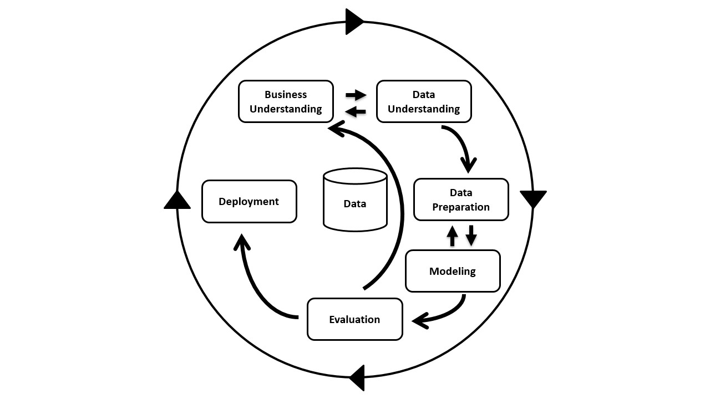

## Sumário 

O objetivo desse post, é servir como um guia geral de Ciência de Dados, a ideia é organizar o minimo de conhecimento sobre a área que todos deveriam ter. Esse post não tem como objetivo ensinar técnicas de aprendizado de máquina, nem nenhuma habilidade verdadeiramente trabalhosa de se adquirir ou compreender. Aqui, irei abordar o processo de ciência de dados, e porque ele é desse jeito, por exemplo, qual a real necessidade de um conjunto de validação? e porque não apenas treino e teste? Para além de processos, abordaremos bastante principais nomenclaturas da área que é interessante todos saberem, para pelo menos termos um vocabulario em comum.

Em suma, ao final desse post, você deve ter uma visão geral da área e não possivelmente não ficará perdido por causa de nomenclaturas desconhecidas.

## Introdução

### O que é Ciência de Dados?
Embora existam variações, a Ciência de Dados pode ser definida formalmente como um campo interdisciplinar que utiliza métodos científicos, processos, algoritmos e sistemas para extrair conhecimento e insights de dados estruturados e não estruturados.

"Ciência de Dados, é a ciência que estuda formas de obter insights não triviais com base em dados"

Bom, por ciência, quero dizer que utilizamos de metódo cientifico, que consiste em uma sequência de passos sistemáticos utilizado para adiquirir/validar conhecimento com base em experiências observáveis e experimentações

Agora, o que quero dizer com insght? Basicamente uma compreensão clara e acionável sobre algo.

Em outras palavras, ciência de dados é o processo de obter um conhecimento não trivial (não óbvio) apartir de dados

## O processo de ciência de dados

Bom, agora para fazermos Ciência de Dados, precisamos começar por algo, mas o que é esse algo? Muitos gostam de dizer que são dados, mas eu discordo dessa perspectiva, o algo é uma pegunta, um problema.
Antes de tudo, você precisa saber o que quer fazer, e isso pode ser algo bem generico, como "quero saber quais clientes tem mais chance de gastar mais", "quero saber qual o preço de uma casa" e "quero saber qual pessoa vai ficar doente", mas também pode ser algo muito especifico "...ou até algo cirurgicamente específico, como "quero prever a probabilidade de o meu vizinho começar uma obra com furadeira às 7h de um domingo".

Uma vez que temos um problema a ser resolvido, vamos atrás de dados, podemos procurar em fontes publicas de diversas formas, seja via api rest (uma forma padronizada para que diferentes softwares conversem um com o outro), web scraping (pegar dados de sites através de um processo automatizado), ou em casos mais extremos onde os dados não existem, precisamos coletá-los manualmente ou pagar para que alguem o faça para nós, isso é bastante comum com pesquisa eleitoral, onde é precisam pedir manualmente para as pessoas. Se não conseguir os dados de jeito nenhum, apenas desista ou mude o problema que quer resolver, ou então a forma de pensar sobre ele.

Digamos que você seja um Cientista de Dados de uma empresa interessada em medir a tal "felicidade" dos funcionários. Logo de cara, você esbarra no problema: perguntar diretamente "você está feliz?" gera dados viciados; o medo de parecer desmotivado trava a sinceridade. Mas aqui está o segredo: o que a empresa busca, no fundo, não é um estado emocional abstrato, mas sim a satisfação prática com o trabalho e o engajamento real.

É aqui que entra o "pulo do gato". Em vez de tentar capturar o sentimento subjetivo, você muda a pergunta para algo que deixe rastros concretos. Você passa a analisar, por exemplo, a velocidade de resposta nas ferramentas de chat ou o volume de interações em canais de integração. Você parou de perseguir a "felicidade" literal e começou a medir o fluxo de colaboração e a saúde da rotina. Ao ajustar o problema para algo mensurável, você entrega o que a empresa realmente precisava saber o tempo todo, provando que, na Ciência de Dados, muitas vezes o objetivo real não está na pergunta que te fizeram, mas na que você foi capaz de responder com dados.

Ou seja, mudando nosso objetivo de coletar dados sobre a felicidade, para dados que estejam possivelmente correlacionados com felicidade, nos passamos de não ter os dados, para termos os dados.

Mas antes de qualquer algoritmo, entra a Análise Exploratória: o momento de torturar os dados até que eles confessem a verdade. É aqui que você descobre, por exemplo, que o seu funcionário 'mais engajado' é, na verdade, um bot de testes que envia 500 mensagens por segundo no Slack. Sem esse choque de realidade, você corre o risco de concluir que o segredo da produtividade corporativa é, literalmente, deixar de ser humano. Essa parte é util para descobrir correlações e fatos sobre seus dados que talvez você não saiba, isso é particularmente importante caso esteja trabalhando com dados que não entenda, como por exemplo dados fisiologicos sobre o corpo humano para a previsão de uma doença.

Agora que temos os dados, precisamos de algum algoritmos de aprendizado de máquina para extrair conhecimento do modelo, nesse proceso, ao escolhermos um modelo, possivelmente o modelo terá restrições sobre os dados que os nossos dados não respeitam, como por exemplo, a grande maioria dos modelos só aceita numeros como entrada, então utilizamos de técnicas de preprocessamento e limpeza de dados para deixá-los prontos para nosso modelo. Uma vez que o modelo é treinado, obtemos conhecimento com ele, e com isso podemos gerar insights. 

O processo pode acabar aqui a depender da situação, mas ele também pode envolver mais etapas, como por exemplo, poderiamos ter que voltar ao incio porque percebemos que nossa pergunta inicial não fazia sentido, ou então o nosso modelo seja algo de uso continuo, como por exemplo um sistema de recomendação de filmes na Netflix, nós precisariamos implementá-lo no sistema geral da netflix e ficar monitorando para que ele não quebre (sim, modelos podem quebrar)

Todo esse processo é comumente descrito em um diagrama chamado CRISP-DM (Cross-Industry Standard Process for Data Mining)

{#fig-neuron width=70%}

## Dados, informação e conhecimento